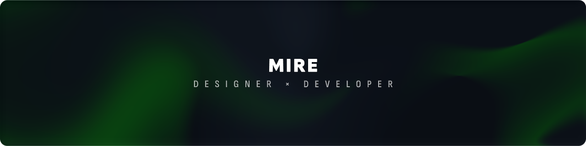
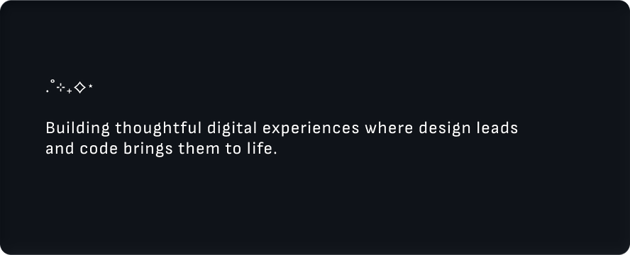
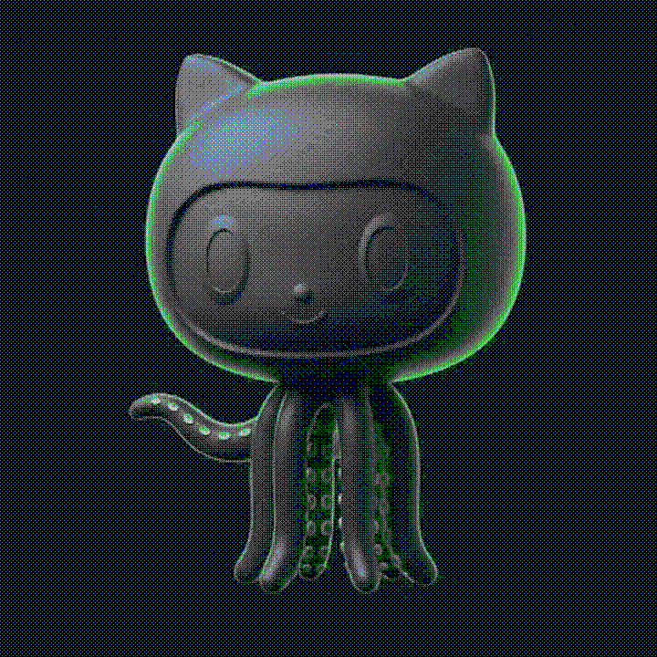
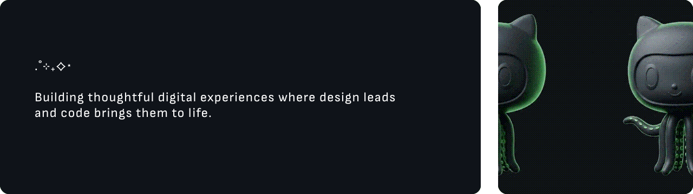

  

  
  &nbsp;
  

<!-- <table width="100%" cellspacing="0" cellpadding="0" style="border-collapse: collapse; border: none; border-spacing: 0; max-width: 1280px;">
  <tr style="border: none;">
    <td width="69.375%" style="border: none; padding: 0; vertical-align: top;">
      
    </td>
    <td width="32" style="border: none; padding: 0; width: 32px;"></td>
    <td width="28.125%" style="border: none; padding: 0; vertical-align: top;">
      
    </td>
  </tr>
</table> -->
<!-- <table width="100%" cellspacing="0" cellpadding="0" style="border-collapse: collapse; border: none; border-spacing: 0; max-width: 1280px;">
  <tr style="border: none;">
    <td width="69.375%" style="border: none; padding: 0; vertical-align: top;">
      
    </td>
    <td width="32" style="border: none; padding: 0; width: 32px;"></td>
    <td width="28.125%" style="border: none; padding: 0; vertical-align: top;">
      
    </td>
  </tr>
</table> -->

<!-- 

  

 -->

  

Hey, I'm Mire (pronounced Mee-ray).  

Computer Science graduate with a foundation in UI/UX Design and a growing focus on Software Development.

I enjoy shaping ideas into experiences that feel intuitive, meaningful, and visually refined.

₊⊹

  

🌱 Learning Full Stack Development  

🌱 Building personal projects  

🌱 Exploring Machine Learning  

🌱 Growing through continuous practice

₊⊹

  

  &nbsp;
  &nbsp;
  &nbsp;
  &nbsp;
  &nbsp;
  

  &nbsp;
  &nbsp;
  &nbsp;
  

  &nbsp;
  &nbsp;
  &nbsp;
  &nbsp;
  &nbsp;
  &nbsp;
  

  &nbsp;
  &nbsp;
  &nbsp;
  &nbsp;
  

<!-- 

  

 •
 •

 
 •
 •

 
 •
 -->

<!-- 
 •  • 
 
 •  • 
 
 •   
-->
₊⊹

  

🍀 Music that builds focus  

🍀 Nature for clarity  

🍀 Solving quietly  

🍀 Design as expression

₊⊹

<!-- 

  

[LinkedIn](https://www.linkedin.com/in/mirepatel) • [Portfolio](https://mirepatel.framer.website/) • [Email](mailto:mirepatel@gmail.com) -->

  

  &nbsp;&nbsp;
  &nbsp;&nbsp;
  

 

**C**ode  
**C**reativity  
**C**ontinuous Learning

•··
